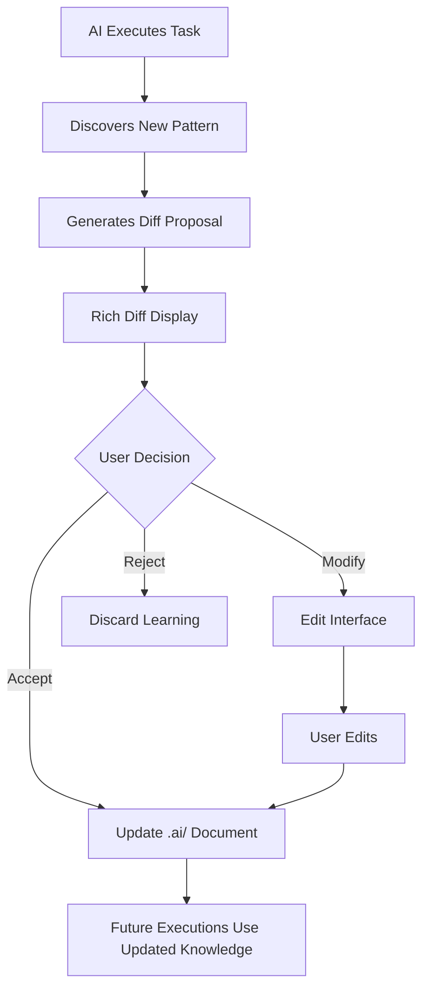

# AI Documents System Design

**The Codebase Self-Awareness Revolution**

> This design document specifies the implementation of the .ai/ documents system that enables every codebase to become self-aware through living documentation that evolves with each interaction.

## Executive Summary

The AI Documents System transforms how AI understands and operates within codebases by maintaining living documents that capture, evolve, and apply codebase-specific intelligence. This replaces the removed pipeline variant with something fundamentally more powerful: codebase self-awareness.

## Core Architecture

### Document Structure

```
<customer-repo>/
├── .ai/
│   ├── AGENTS.md    # How AI should design in THIS codebase
│   ├── PRODUCT.md   # What THIS product actually is
│   └── MCPS.md      # Tools and integrations THIS codebase uses
```

### Document Roles

**AGENTS.md** - Design Intelligence
- Questions about patterns, conventions, architecture
- Unknowledge documentation (what AI doesn't understand)
- Assumptions requiring validation
- Learning from each execution

**PRODUCT.md** - Implementation Truth
- Feature specifications
- Business logic rules
- Performance requirements
- User experience definitions

**MCPS.md** - Integration Specifications
- Available Model Context Protocol tools
- External service configurations
- API integrations
- Custom tool definitions

## Experience Design

### Rich Response Diffs

When AI learns something new about a codebase, it presents changes as reviewable diffs:

```typescript
interface AILearning {
  documentPath: '.ai/AGENTS.md' | '.ai/PRODUCT.md' | '.ai/MCPS.md'
  proposedChanges: Diff[]
  confidence: number
  source: 'execution' | 'analysis' | 'user-feedback'
  reasoning: string
}

interface Diff {
  operation: 'add' | 'modify' | 'remove'
  path: string  // Section path in document
  before?: string
  after: string
  lineNumbers: { start: number, end: number }
}
```

### User Interaction Flow



### UI Components

#### Diff Viewer Component

```typescript
interface DiffViewerProps {
  diff: AILearning
  onAccept: () => void
  onModify: () => void
  onReject: () => void
}

// Visual representation:
// +-------------------- AI Learning Proposal --------------------+
// | 📄 .ai/AGENTS.md                                            |
// |                                                              |
// | + ### How should authentication work in this codebase?      |
// | + Always use JWT with refresh rotation                      |
// | + Store in httpOnly cookies, never localStorage            |
// | + All auth checks through middleware/auth.ts               |
// |                                                              |
// | Confidence: 92%                                             |
// | Source: Analyzed 47 auth-related files                      |
// |                                                              |
// | [Accept] [Modify] [Reject]                                  |
// +--------------------------------------------------------------+
```

#### Inline Editor Component

```typescript
interface InlineEditorProps {
  initialContent: string
  documentPath: string
  onSave: (content: string) => void
  syntaxHighlighting: 'markdown'
  aiSuggestions: boolean  // Show AI suggestions while editing
}
```

## Implementation Architecture

### Backend Services

#### Document Manager Service

```typescript
class AIDocumentManager {
  async initialize(repoPath: string): Promise<void> {
    // Create .ai/ directory if not exists
    // Initialize with starter templates
    // Load existing documents
  }

  async proposeUpdate(
    learning: AILearning
  ): Promise<ProposalId> {
    // Store proposal for user review
    // Generate diff
    // Calculate confidence score
    return proposalId
  }

  async applyUpdate(
    proposalId: ProposalId,
    modifications?: string
  ): Promise<void> {
    // Apply accepted/modified changes
    // Update document
    // Version control integration
  }

  async getContext(
    instruction: string
  ): Promise<CodebaseContext> {
    // Parse all .ai/ documents
    // Extract relevant context
    // Return structured knowledge
  }
}
```

#### Learning Engine

```typescript
class LearningEngine {
  async extractPatterns(
    execution: ExecutionResult
  ): Promise<Pattern[]> {
    // Analyze execution traces
    // Identify recurring patterns
    // Extract conventions
  }

  async generateUnknowledge(
    execution: ExecutionResult
  ): Promise<Unknowledge[]> {
    const unknowns: Unknowledge[] = []

    // Extract Active Unknowns from failures
    for (const failure of execution.failures) {
      unknowns.push({
        type: 'unknown',
        subject: failure.context,
        confidence: 0,
        evidence: {
          supporting: [],
          conflicting: [failure.error]
        },
        questions: this.generateQuestions(failure),
        investigations: this.planInvestigations(failure),
        hypothesis: this.formHypothesis(failure)
      })
    }

    // Extract Assumptions from uncertain decisions
    for (const decision of execution.decisions) {
      if (decision.confidence < 50) {
        unknowns.push({
          type: 'assumption',
          subject: decision.context,
          confidence: decision.confidence,
          evidence: decision.evidence,
          questions: [`Is this assumption correct: ${decision.reasoning}?`],
          investigations: [{
            action: `Validate: ${decision.reasoning}`,
            completed: false
          }],
          impact: decision.impact
        })
      }
    }

    // Extract Contradictions from conflicts
    for (const conflict of execution.conflicts) {
      unknowns.push({
        type: 'contradiction',
        subject: conflict.context,
        confidence: -1,
        evidence: {
          supporting: [conflict.expected],
          conflicting: [conflict.found]
        },
        questions: ['Which is correct?', 'Why do both exist?'],
        investigations: this.planConflictResolution(conflict),
        resolution: conflict.resolution
      })
    }

    return unknowns
  }

  async validateAssumptions(
    execution: ExecutionResult,
    assumptions: Assumption[]
  ): Promise<ValidationResult[]> {
    // Check if assumptions held true
    // Update confidence scores
    // Generate corrections
  }
}
```

### Frontend Integration

#### Execution Interface Enhancement

```typescript
// In ExecutionPageClient.tsx
interface ExecutionUIState {
  // Existing state...
  aiLearnings: AILearning[]
  pendingProposals: ProposalId[]
  documentContext: CodebaseContext
}

// New UI section for AI learnings
function AILearningsPanel({
  learnings,
  onReview
}: AILearningsPanelProps) {
  return (
    <div className="ai-learnings-panel">
      <h3>🧠 AI Discovered {learnings.length} New Patterns</h3>
      {learnings.map(learning => (
        <LearningCard
          key={learning.id}
          learning={learning}
          onReview={() => onReview(learning)}
        />
      ))}
    </div>
  )
}
```

#### Conversations Enhancement

```typescript
// In ConversationsOverlay.tsx
function ConversationWithContext({
  message,
  codebaseContext
}: ConversationProps) {
  // Show which .ai/ knowledge is being used
  return (
    <div className="conversation-message">
      <ContextIndicator
        sources={codebaseContext.sources}
        confidence={codebaseContext.confidence}
      />
      <MessageContent content={message} />
    </div>
  )
}
```

### Database Schema

```sql
-- Proposals table for pending AI learnings
CREATE TABLE ai_document_proposals (
  id UUID PRIMARY KEY DEFAULT uuid_generate_v4(),
  repo_id UUID REFERENCES vcs_repositories(id),
  document_path TEXT NOT NULL,
  proposed_diff JSONB NOT NULL,
  confidence FLOAT NOT NULL,
  source TEXT NOT NULL,
  reasoning TEXT,
  status TEXT DEFAULT 'pending', -- pending, accepted, modified, rejected
  created_at TIMESTAMPTZ DEFAULT NOW(),
  resolved_at TIMESTAMPTZ,
  resolved_by UUID REFERENCES auth.users(id),
  applied_content TEXT -- Modified content if user edited
);

-- Learning history for pattern recognition
CREATE TABLE ai_learning_history (
  id UUID PRIMARY KEY DEFAULT uuid_generate_v4(),
  repo_id UUID REFERENCES vcs_repositories(id),
  pattern_type TEXT NOT NULL,
  pattern_content JSONB NOT NULL,
  occurrences INTEGER DEFAULT 1,
  last_seen TIMESTAMPTZ DEFAULT NOW(),
  confidence FLOAT NOT NULL
);

-- Unknowledge tracking
CREATE TABLE ai_unknowledge (
  id UUID PRIMARY KEY DEFAULT uuid_generate_v4(),
  repo_id UUID REFERENCES vcs_repositories(id),
  question TEXT NOT NULL,
  context JSONB,
  attempts INTEGER DEFAULT 0,
  resolved BOOLEAN DEFAULT FALSE,
  resolution TEXT,
  created_at TIMESTAMPTZ DEFAULT NOW(),
  resolved_at TIMESTAMPTZ
);
```

## Key Features

### 1. Generating Unknowledge (Novel Format)

The system actively documents what it doesn't know using a structured, actionable format:

```markdown
## Unknowledge Manifest

### Active Unknowns [Confidence: 0%]

UNKNOWN: Authentication Flow
  EVIDENCE: Found 3 different auth patterns in codebase
  QUESTIONS:
    - Why does AuthService.authenticate() bypass middleware for /admin?
    - What triggers the fallback to BasicAuth in auth/legacy.ts?
    - When should JWT refresh happen vs full re-auth?
  INVESTIGATION:
    - [ ] Trace execution path for successful login
    - [ ] Analyze middleware bypass conditions
    - [ ] Document refresh token lifecycle
  HYPOTHESIS: Admin routes use session-based auth for security

UNKNOWN: EventBus Purpose
  EVIDENCE: Custom implementation despite having Redis
  QUESTIONS:
    - What makes this EventBus different from Redis pub/sub?
    - Why are only certain events routed through it?
    - How does it handle failures/retries?
  INVESTIGATION:
    - [ ] Compare with Redis pub/sub capabilities
    - [ ] Trace all event publishers and subscribers
    - [ ] Load test for failure modes
  HYPOTHESIS: EventBus provides transaction guarantees Redis doesn't

### Unvalidated Assumptions [Confidence: <50%]

ASSUMPTION: All API routes follow REST conventions
  CONFIDENCE: 30%
  EVIDENCE FOR: 47 routes match REST patterns
  EVIDENCE AGAINST: Found GraphQL endpoint at /api/graphql
  VALIDATION NEEDED:
    - [ ] Scan all route definitions
    - [ ] Check for WebSocket endpoints
    - [ ] Document API versioning strategy
  IMPACT IF WRONG: Generated API calls will fail for non-REST endpoints

ASSUMPTION: Database migrations run automatically
  CONFIDENCE: 15%
  EVIDENCE FOR: Migration files exist
  EVIDENCE AGAINST: No migration runner in package.json scripts
  VALIDATION NEEDED:
    - [ ] Check deployment scripts
    - [ ] Look for migration hooks in CI/CD
    - [ ] Test migration execution
  IMPACT IF WRONG: Database changes won't apply, causing schema mismatch

### Discovered Contradictions [Confidence: Negative]

CONTRADICTION: Test Framework
  EXPECTED: Jest (based on jest.config.js)
  FOUND: Vitest (all test files use Vitest imports)
  RESOLUTION: Vitest is correct, jest.config.js is legacy
  ACTION: Ignore Jest configuration

CONTRADICTION: State Management
  EXPECTED: Redux (redux packages installed)
  FOUND: Zustand (all state uses Zustand stores)
  RESOLUTION: Migration from Redux to Zustand incomplete
  ACTION: Use Zustand for new features, mark Redux for removal
```

#### Unknowledge Processing Pipeline

```typescript
interface Unknowledge {
  id: string
  type: 'unknown' | 'assumption' | 'contradiction'
  subject: string
  confidence: number // 0-100, negative for contradictions
  evidence: {
    supporting: string[]
    conflicting: string[]
  }
  questions: string[]
  investigations: Investigation[]
  hypothesis?: string
  impact?: string
  resolution?: string
}

interface Investigation {
  action: string
  completed: boolean
  findings?: string
  confidence_delta?: number // How much this changes confidence
}

// Unknowledge evolves through investigation
class UnknowledgeEvolution {
  async investigate(unknowledge: Unknowledge): Promise<void> {
    for (const investigation of unknowledge.investigations) {
      if (!investigation.completed) {
        const findings = await this.execute(investigation.action)
        investigation.findings = findings
        investigation.completed = true

        // Adjust confidence based on findings
        unknowledge.confidence += investigation.confidence_delta || 0

        // Convert to knowledge if confidence > 80%
        if (unknowledge.confidence > 80) {
          await this.convertToKnowledge(unknowledge)
        }
      }
    }
  }

  async convertToKnowledge(unknowledge: Unknowledge): Promise<void> {
    // Move from unknowledge to validated pattern in AGENTS.md
    const pattern = this.extractPattern(unknowledge)
    await this.updateAgentsDocument(pattern)
  }
}
```

#### The Unknowledge Hierarchy

1. **Active Unknowns** (0% confidence): Things we know we don't know
2. **Unvalidated Assumptions** (<50% confidence): Things we think we know but haven't proven
3. **Discovered Contradictions** (negative confidence): Things that directly conflict
4. **Emerging Patterns** (50-80% confidence): Things becoming clear through investigation
5. **Validated Knowledge** (>80% confidence): Things we've proven through execution

### 2. Highly Amenable Instructions

Same instruction, different execution based on .ai/ context:

```typescript
async function executeInstruction(
  instruction: "Add user authentication",
  context: CodebaseContext
): Promise<Execution> {

  // Parse .ai/AGENTS.md for patterns
  const authPattern = context.getPattern('authentication')

  // Parse .ai/PRODUCT.md for requirements
  const authRequirements = context.getRequirements('authentication')

  // Parse .ai/MCPS.md for available tools
  const authTools = context.getTools('authentication')

  // Execution adapts to THIS codebase
  return execute({
    pattern: authPattern || 'default-jwt',
    requirements: authRequirements || 'standard-security',
    tools: authTools || 'built-in'
  })
}
```

### 3. Continuous Evolution

Every execution potentially updates .ai/ documents:

```typescript
class EvolutionEngine {
  async afterExecution(result: ExecutionResult): Promise<void> {
    // Extract learnings
    const patterns = await this.extractPatterns(result)
    const unknowledge = await this.extractUnknowledge(result)
    const validations = await this.validateAssumptions(result)

    // Propose updates
    if (patterns.length > 0) {
      await this.proposeAgentsUpdate(patterns)
    }

    if (unknowledge.length > 0) {
      await this.proposeUnknowledgeUpdate(unknowledge)
    }

    if (validations.some(v => !v.valid)) {
      await this.proposeAssumptionCorrection(validations)
    }
  }
}
```

## Integration Points

### With Deliverables Pipeline

```typescript
// In packages/pipelines/deliverable/src/index.ts
class DeliverablePipeline {
  async execute(instruction: Instruction): Promise<Deliverable> {
    // Load codebase context from .ai/ documents
    const context = await aiDocumentManager.getContext(instruction)

    // Execute with context awareness
    const result = await this.executeWithContext(instruction, context)

    // Learn from execution
    await learningEngine.learn(result)

    return result
  }
}
```

### With Conversations

```typescript
// In packages/conversations-generics/
class ConversationAgent {
  async respond(message: string): Promise<Response> {
    // Get codebase-specific knowledge
    const knowledge = await aiDocumentManager.getKnowledge()

    // Generate context-aware response
    return this.generateResponse(message, knowledge)
  }
}
```

### With Orbitals

```typescript
// In app/orbitals/
function OrbitalsAIDocuments() {
  // New orbital panel for managing .ai/ documents
  return (
    <OrbitalsPane>
      <DocumentViewer document=".ai/AGENTS.md" />
      <DocumentViewer document=".ai/PRODUCT.md" />
      <DocumentViewer document=".ai/MCPS.md" />
      <ProposalQueue proposals={pendingProposals} />
    </OrbitalsPane>
  )
}
```

## Success Metrics

### User-Facing Metrics
- **Learning Acceptance Rate**: >80% of proposed updates accepted
- **Instruction Success Rate**: >95% success on repeated instructions
- **Context Relevance**: >90% of executions use .ai/ knowledge
- **Unknowledge Resolution**: <24 hours average resolution time

### System Metrics
- **Pattern Recognition Accuracy**: >85% pattern identification
- **Assumption Validation Rate**: >70% assumptions validated
- **Knowledge Compound Rate**: 10% monthly increase in documented patterns
- **Execution Improvement**: 5% faster execution time per pattern learned

## Implementation Phases

### Phase 1: Foundation (Week 1-2)
- [ ] Create .ai/ directory structure on repo selection
- [ ] Implement basic document reading in execution context
- [ ] Add starter templates for each document
- [ ] Basic diff generation for proposals

### Phase 2: Learning Engine (Week 3-4)
- [ ] Pattern extraction from executions
- [ ] Unknowledge documentation
- [ ] Assumption tracking and validation
- [ ] Confidence scoring algorithm

### Phase 3: Rich UI (Week 5-6)
- [ ] Diff viewer component
- [ ] Inline editor with syntax highlighting
- [ ] Proposal queue in Orbitals
- [ ] Context indicators in Conversations

### Phase 4: Intelligence Loop (Week 7-8)
- [ ] Automatic pattern recognition
- [ ] Proactive unknowledge investigation
- [ ] Cross-repository pattern sharing (optional)
- [ ] Performance optimization based on patterns

## Security Considerations

### Document Access Control
- .ai/ documents are user-specific, not shared across accounts
- Each user maintains their own codebase understanding
- No cross-contamination of proprietary patterns

### Learning Isolation
- Patterns learned from one repository don't affect others
- User can reset .ai/ documents at any time
- All learnings are auditable and reversible

## Future Enhancements

### Team Collaboration
- Shared .ai/ documents for team repositories
- Merge conflict resolution for document updates
- Role-based approval for pattern changes

### Advanced Learning
- Cross-repository pattern recognition (with permission)
- Industry-specific pattern libraries
- Community-contributed patterns

### Integration Expansion
- IDE plugins that read .ai/ documents
- CI/CD integration for pattern validation
- Git hooks for .ai/ document updates

## Conclusion

The AI Documents System represents a fundamental shift from static AI that treats every codebase the same, to dynamic AI that learns and adapts to each codebase's unique patterns, conventions, and requirements. By making AI learning visible, editable, and versionable through .ai/ documents, we give users unprecedented control over how AI understands and operates within their code.

This is not just a feature - it's the foundation for truly intelligent, codebase-aware AI that gets better with every interaction.
