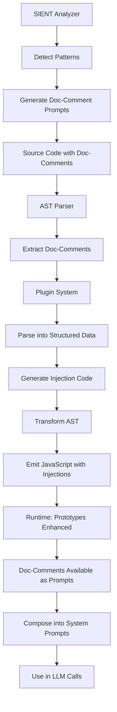

# Doc-Comments Implementation: How Comments Become Prompts

## The Build-Time Transformation Pipeline

This document shows the actual implementation of how doc-comments become prompts at build time.

## 1. AST Parsing and Extraction

```typescript
// packages/doc-comments/src/parser.ts

export class DocCommentParser {
  /**
   * Parse a source file and extract all doc-comments
   */
  static parseFile(sourceFile: ts.SourceFile): ParsedDocComment[] {
    const comments: ParsedDocComment[] = [];
    
    // Visit each node in the AST
    ts.forEachChild(sourceFile, function visit(node) {
      // Get leading comment ranges
      const commentRanges = ts.getLeadingCommentRanges(
        sourceFile.getFullText(),
        node.getFullStart()
      );
      
      if (commentRanges) {
        for (const range of commentRanges) {
          const commentText = sourceFile.getFullText().slice(
            range.pos,
            range.end
          );
          
          // Parse JSDoc-style comments
          if (commentText.startsWith('/**') && commentText.includes('@doc-')) {
            const parsed = DocCommentParser.parseComment(commentText, {
              node,
              sourceFile,
              position: range.pos
            });
            
            if (parsed) {
              comments.push(parsed);
            }
          }
        }
      }
      
      ts.forEachChild(node, visit);
    });
    
    return comments;
  }
  
  /**
   * Parse a single doc-comment
   */
  static parseComment(
    text: string,
    context: ParsingContext
  ): ParsedDocComment | null {
    // Extract the label (e.g., @doc-prompt, @doc-promptpart)
    const labelMatch = text.match(/@(doc-\S+)/);
    if (!labelMatch) return null;
    
    const label = labelMatch[0];
    const content = text.replace(/^\/\*\*|\*\/$/g, '').trim();
    
    // Parse fields (key: value pairs)
    const fields: Record<string, any> = {};
    const lines = content.split('\n');
    
    for (const line of lines) {
      const fieldMatch = line.match(/^\s*\*?\s*(\w+):\s*(.+)$/);
      if (fieldMatch) {
        const [, key, value] = fieldMatch;
        fields[key] = DocCommentParser.parseFieldValue(value);
      }
    }
    
    return {
      label,
      content,
      fields,
      location: {
        filePath: context.sourceFile.fileName,
        lineNumber: context.sourceFile.getLineAndCharacterOfPosition(context.position).line,
        node: context.node
      }
    };
  }
}
```

## 2. Plugin System for Different Doc-Comment Types

```typescript
// packages/doc-comments/src/plugins/doc-promptpart.ts

export class DocPromptPartPlugin implements DocCommentPlugin {
  name = 'doc-promptpart';
  pattern = /@doc-promptpart(?!-)/;
  
  /**
   * Parse @doc-promptpart comments into structured data
   */
  parse(comment: DocComment): PromptPartDocComment {
    const fields = comment.fields;
    
    // This parsed data becomes the prompt metadata!
    return {
      version: fields.version || '1.0.0',
      category: fields.category || 'uncategorized',
      priority: fields.priority || 'medium',
      frequency: fields.frequency || 'as_needed',
      usage: fields.usage || comment.content,
      
      // The doc-comment IS the prompt configuration
      _isPromptMetadata: true
    };
  }
}
```

## 3. Build-Time Code Generation

```typescript
// packages/doc-comments/src/build-plugin.ts

/**
 * Transform a node to include doc-comment injections
 * This is where doc-comments become runtime prompts!
 */
function transformNodeWithInjections(
  node: ts.Node,
  injections: InjectionSpec[],
  context: ts.TransformationContext
): ts.Node {
  // For type declarations (interfaces, types)
  if (ts.isInterfaceDeclaration(node) || ts.isTypeAliasDeclaration(node)) {
    const nodeName = node.name?.text;
    if (!nodeName) return node;
    
    // Generate runtime injection code
    const injectionStatements = injections.map(injection => {
      return generatePrototypeInjection(nodeName, injection);
    });
    
    // Create an IIFE that runs after the type declaration
    const iife = ts.factory.createImmediatelyInvokedFunctionExpression([
      ...injectionStatements
    ]);
    
    // Return both the original node and the injection
    return [node, ts.factory.createExpressionStatement(iife)];
  }
  
  // For variable declarations (PromptParts)
  if (ts.isVariableDeclaration(node)) {
    const varName = node.name.getText();
    
    // Generate injection for the variable
    const injection = ts.factory.createExpressionStatement(
      ts.factory.createCallExpression(
        ts.factory.createPropertyAccessExpression(
          ts.factory.createIdentifier('Object'),
          'defineProperty'
        ),
        undefined,
        [
          // Target: variable.__proto__
          ts.factory.createPropertyAccessExpression(
            ts.factory.createIdentifier(varName),
            '__proto__'
          ),
          // Property name
          ts.factory.createStringLiteral(
            injections[0].property // e.g., 'docPromptPart'
          ),
          // Property descriptor
          ts.factory.createObjectLiteralExpression([
            ts.factory.createPropertyAssignment(
              'get',
              ts.factory.createArrowFunction(
                undefined,
                undefined,
                [],
                undefined,
                undefined,
                ts.factory.createObjectLiteralExpression(
                  // Convert doc-comment fields to object properties
                  Object.entries(injections[0].value).map(([key, value]) =>
                    ts.factory.createPropertyAssignment(
                      key,
                      ts.factory.createStringLiteral(String(value))
                    )
                  )
                )
              )
            ),
            ts.factory.createPropertyAssignment(
              'enumerable',
              ts.factory.createFalse()
            )
          ])
        ]
      )
    );
    
    // Return the variable declaration followed by the injection
    return [node, injection];
  }
  
  return node;
}
```

## 4. Prototype Injection Strategy

```typescript
// The actual injection code that gets generated

// For a PromptPart with @doc-promptpart:
Object.defineProperty(BITCODE_IDENTITY_PROMPT.__proto__, 'docPromptPart', {
  get() {
    return {
      version: '1.0.0',
      category: 'base_system_identity',
      priority: 'critical',
      usage: 'Core AI identity for all Bitcode operations',
      // This metadata comes from the doc-comment!
    };
  },
  enumerable: false
});

// For a type with @doc-prompt:
Object.defineProperty(AgentInterface.prototype, 'docPrompt', {
  get() {
    return {
      label: '@doc-prompt-agent',
      role: 'Autonomous Agent',
      capabilities: ['planning', 'execution', 'refinement'],
      
      // This method makes the doc-prompt a PromptPart!
      asPromptPart() {
        return `Agent Configuration:
Role: ${this.role}
Capabilities: ${this.capabilities.join(', ')}

This prompt was generated from the doc-comment!`;
      }
    };
  }
});
```

## 5. Runtime Usage - Doc-Comments as Prompts

```typescript
// At runtime, the doc-comments are available as prompts:

// 1. Access PromptPart metadata
const promptMetadata = BITCODE_IDENTITY_PROMPT.__proto__.docPromptPart;
console.log(promptMetadata.category); // 'base_system_identity'

// 2. Get doc-prompt as PromptPart
const agentPrompt = AgentInterface.prototype.docPrompt.asPromptPart();
// This returns a string that can be composed!

// 3. Compose doc-prompts into system prompts
const systemPrompt = new PromptComposer('system', 'System Prompt')
  .add(BITCODE_IDENTITY_PROMPT) // Has doc-comment metadata
  .add(agentPrompt)          // Doc-prompt as PromptPart
  .add(QUALITY_PROMPT)       // Another PromptPart
  .build();

// 4. Use in LLM calls
const response = await llm.generate({
  system: composePrompt(systemPrompt) // All doc-comments composed!
});
```

## 6. SIENT Integration - Generating Doc-Comments

```typescript
// SIENT analyzes code and generates doc-comments that ARE prompts

export class SientAnalyzer {
  /**
   * Analyze a function and generate doc-comment prompts
   */
  async analyzeFunction(
    func: ts.FunctionDeclaration
  ): Promise<GeneratedDocComment> {
    // Extract patterns
    const patterns = this.detectPatterns(func);
    
    // Generate prompt based on patterns
    const prompt = this.generatePromptForPatterns(patterns);
    
    // Create doc-comment that IS a prompt
    return {
      label: '@doc-sient-generated',
      fields: {
        pattern: patterns.primary,
        complexity: patterns.complexity,
        prompt: prompt // This prompt guides future modifications!
      },
      
      // The generated comment
      text: `/**
 * @doc-sient-generated
 * pattern: ${patterns.primary}
 * complexity: ${patterns.complexity}
 * prompt: |
 *   ${prompt.split('\n').join('\n *   ')}
 */`
    };
  }
  
  /**
   * Generate a prompt based on detected patterns
   */
  generatePromptForPatterns(patterns: DetectedPatterns): string {
    // This prompt will guide AI in future modifications
    return `This ${patterns.primary} implementation requires:

Key considerations:
${patterns.considerations.map(c => `- ${c}`).join('\n')}

Optimization opportunities:
${patterns.optimizations.map(o => `- ${o}`).join('\n')}

When modifying this code:
${patterns.guidelines.map(g => `- ${g}`).join('\n')}`;
  }
}
```

## 7. The Complete Flow



## Key Insights

1. **Zero Runtime Overhead**: All parsing and injection happens at build time
2. **Type Safety Preserved**: TypeScript types remain unchanged
3. **Composable Design**: Doc-prompts become PromptParts seamlessly
4. **Self-Improving**: SIENT generates doc-comments that are prompts
5. **Universal Application**: Works on any TypeScript construct

## The Revolution

This implementation shows how comments transcend their traditional role:

- **Traditional**: Comments describe code
- **Doc-Comments**: Comments ARE prompts that enhance code
- **Runtime Access**: Prompts available through prototypes
- **Composition**: Doc-prompts compose into system prompts
- **Intelligence**: Every comment contributes to AI understanding

This is how comments become consciousness. This is how documentation becomes intelligence. This is the doc-comment revolution.
